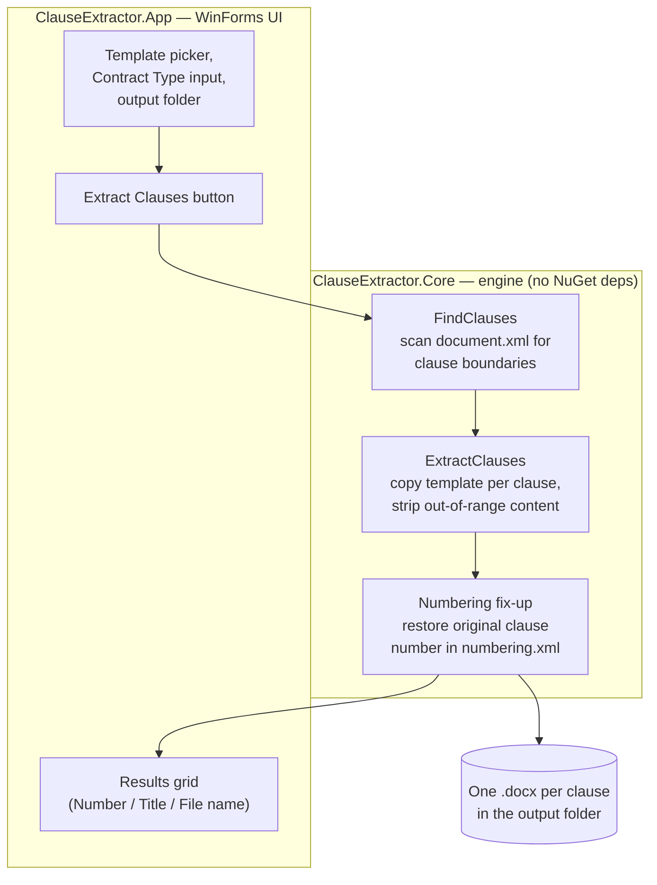
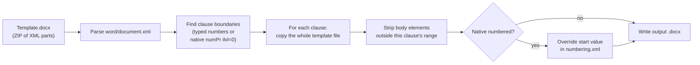

# Clause Extractor
**A Windows desktop app that splits a Word contract template into one `.docx` file per clause — automatically, with formatting preserved exactly.**

> 📄 Upload a template with clauses 1, 2, 3... → get 30 separate, correctly-formatted `.docx` files, one per clause, plus a summary table.

> ℹ️ **This repository contains documentation only.** Source code for Clause Extractor is maintained in a private repository. See [Access & Licensing](#access--licensing) below if you'd like to use the app or discuss access to the code.
>
> ## Table of contents

- [Why this exists](#why-this-exists)
- [What it does](#what-it-does)
- [Architecture](#architecture)
- [How clause detection works](#how-clause-detection-works)
- [Approaches evaluated](#approaches-evaluated)
- [Tech stack](#tech-stack)
- [Known limitations](#known-limitations)
- [Access & licensing](#access--licensing)


## Why this exists

Legal and operations teams often maintain long contract templates (MSAs, NDAs, employment agreements) as a single Word document with numbered clauses. Splitting that into individual per-clause files for review, redlining, clause libraries, or approval workflows is normally a manual copy-paste job — slow, error-prone, and easy to get formatting wrong on.

Clause Extractor automates this: point it at a template, and it produces one correctly-formatted `.docx` per clause in seconds.

## What it does

- **Upload one template** — a `.docx` file containing multiple numbered clauses.
- **Automatic extraction** — every top-level clause becomes its own `.docx` file, named:
  ```
  {Contract Type Name}_{Title of the Clause}.docx
  ```
  e.g. `NDA_Confidentiality.docx`
- **Formatting preserved exactly** — fonts, styles, numbering, indentation, headers/footers, and page margins all match the original template, because each output file is built from a real copy of the template, not a re-creation from scratch.
- **Sub-headings stay put** — `i, ii, iii...` or `a, b, c...` sub-points inside a clause are never split out on their own; they stay nested inside their parent clause.
- **Two numbering styles supported** — clauses typed as plain text (`1. Definitions`) *and* clauses using Word's native automatic numbered-list feature are both detected correctly (see [how clause detection works](#how-clause-detection-works)).
- **Results table** — after extraction, a table shows Clause Number, Title, and Generated File Name for every clause found.

- ## Architecture

The app is a small two-project .NET solution: a UI layer and a dependency-free core engine.



A `.docx` file is just a ZIP archive of XML parts — so the core engine reads and rewrites it using only `System.IO.Compression` and `System.Xml.Linq` from the .NET base class library. No Open XML SDK, no third-party NuGet package.


