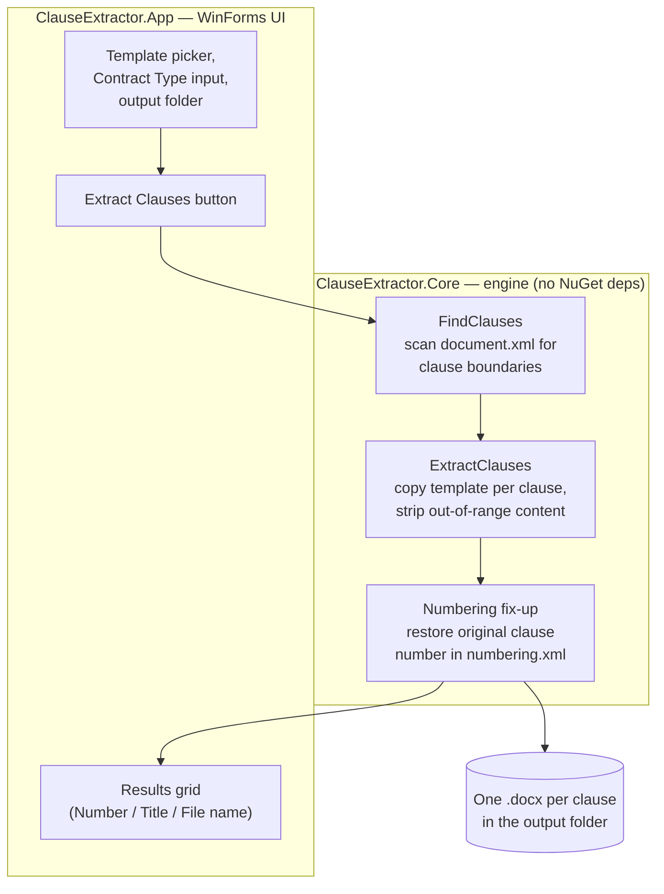
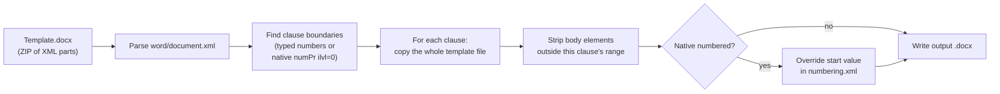

# Clause Extractor
**A Windows desktop app that splits a Word contract template into one `.docx` file per clause — automatically, with formatting preserved exactly.**

> 📄 Upload a template with clauses 1, 2, 3... → get 30 separate, correctly-formatted `.docx` files, one per clause, plus a summary table.

> ℹ️ **This repository contains documentation only.** Source code for Clause Extractor is maintained in a private repository. See [Access & Licensing](#access--licensing) below if you'd like to use the app or discuss access to the code.
>
> ## Table of contents

- [Why this exists](#why-this-exists)
- [What it does](#what-it-does)
- [Architecture](#architecture)
- [How clause detection works](#how-clause-detection-works)
- [Approaches evaluated](#approaches-evaluated)
- [Tech stack](#tech-stack)
- [Known limitations](#known-limitations)
- [Access & licensing](#access--licensing)


## Why this exists

Legal and operations teams often maintain long contract templates (MSAs, NDAs, employment agreements) as a single Word document with numbered clauses. Splitting that into individual per-clause files for review, redlining, clause libraries, or approval workflows is normally a manual copy-paste job — slow, error-prone, and easy to get formatting wrong on.

Clause Extractor automates this: point it at a template, and it produces one correctly-formatted `.docx` per clause in seconds.

## What it does

- **Upload one template** — a `.docx` file containing multiple numbered clauses.
- **Automatic extraction** — every top-level clause becomes its own `.docx` file, named:
  ```
  {Contract Type Name}_{Title of the Clause}.docx
  ```
  e.g. `NDA_Confidentiality.docx`
- **Formatting preserved exactly** — fonts, styles, numbering, indentation, headers/footers, and page margins all match the original template, because each output file is built from a real copy of the template, not a re-creation from scratch.
- **Sub-headings stay put** — `i, ii, iii...` or `a, b, c...` sub-points inside a clause are never split out on their own; they stay nested inside their parent clause.
- **Two numbering styles supported** — clauses typed as plain text (`1. Definitions`) *and* clauses using Word's native automatic numbered-list feature are both detected correctly (see [how clause detection works](#how-clause-detection-works)).
- **Results table** — after extraction, a table shows Clause Number, Title, and Generated File Name for every clause found.

- ## Architecture

The app is a small two-project .NET solution: a UI layer and a dependency-free core engine.



A `.docx` file is just a ZIP archive of XML parts — so the core engine reads and rewrites it using only `System.IO.Compression` and `System.Xml.Linq` from the .NET base class library. No Open XML SDK, no third-party NuGet package.



## How clause detection works

Two ways a template can number its clauses, and both are supported — even mixed in the same document:

1. **Typed numbers** — a paragraph whose text literally begins with a number followed by `.` or `)`, e.g. `1. Definitions`, `2) Term`, `3 - Payment`. The title is whatever follows the number on that line.
2. **Word's native/automatic numbered lists** — a paragraph carrying Word's own list numbering at the outermost indent level. Word draws the "1." itself; it's never present as text, so the paragraph's own text (e.g. "Definitions") becomes the title.

In both cases, sub-points — lettered, roman-numeral, or deeper native list levels — never start a new top-level clause. They stay nested inside whichever clause heading they follow.

**A subtlety worth calling out:** Word calculates a native list's number dynamically from the items around it. Isolate one clause into its own file, and Word would normally renumber it back to "1." regardless of its original position. Clause Extractor fixes this by writing a small start-value override into that file's own numbering definition, so an extracted clause keeps displaying its true original number (e.g. "4. Confidentiality").

## Approaches evaluated

This app went through a couple of iterations before landing on its current design. Documenting them here because the reasoning is often as useful as the result:

| Approach | Verdict | Notes |
|---|---|---|
| **Python + Tkinter + `python-docx`** | Prototype, replaced | Fast to build and worked well, but wasn't a genuine native Windows application — packaging it as an `.exe` requires bundling a Python runtime via PyInstaller, which felt like the wrong foundation for a real desktop tool. |
| **C# + Open XML SDK (`DocumentFormat.OpenXml`)** | Considered, not used | Microsoft's official library for this exact job, and a very reasonable choice. Passed over here specifically to keep the project **dependency-free** — no NuGet package to restore, install, or version-pin, which also made it possible to build and test entirely offline. |
| **C# + raw OOXML manipulation** (`System.IO.Compression` + `System.Xml.Linq`) | **Chosen** | A `.docx` is just a ZIP of XML — this uses only the .NET base class library. Each output file starts as a byte-for-byte copy of the template, so formatting fidelity is exact by construction rather than something to reconstruct. |
| **Commercial libraries** (Aspose.Words, Spire.Doc, GemBox.Document) | Not evaluated in depth | Capable, well-documented libraries, but licensed/commercial — ruled out for a project intended to have zero external dependencies and no licensing overhead. Worth a look if you need heavier document manipulation (PDF export, complex merge fields, etc.) than this project requires. |

## Tech stack

- **.NET 8**, C#
- **WinForms** for the desktop UI
- **`System.IO.Compression` + `System.Xml.Linq`** for all `.docx`/OOXML manipulation — zero external NuGet packages
- Tested against both typed-number and native-Word-numbering templates, including nested `a/b/i/ii/iii` sub-clause structures up to 3 levels deep

## Known limitations

- Only `.docx` templates are supported (not legacy `.doc` or PDF).
- Clause detection assumes each top-level clause heading is either a typed number or a level-0 native list item — templates with unconventional numbering schemes may need review.
- If two clauses sanitize to the same output file name (e.g. duplicate titles), the app appends `(1)`, `(2)`, etc. so no file is ever overwritten.

## Access & licensing

Source code is maintained privately. If you'd like to use the compiled app or discuss access to the source:

- 📧 **Access / licensing enquiries**:shaswata.barua0499@outlook.com

---

<sub>This README documents the project's design and behavior for anyone evaluating or using Clause Extractor. It does not include implementation source code.</sub>
